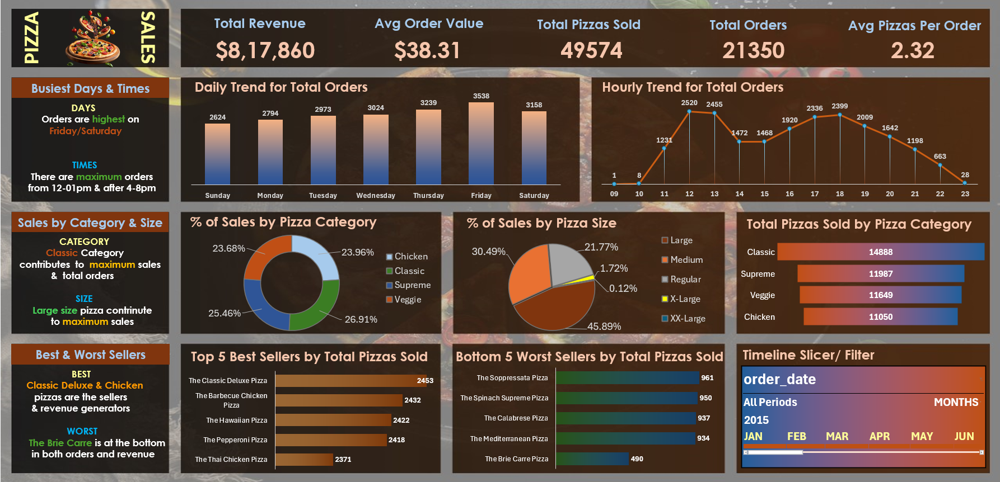

# 🍕 Pizza Sales Analytics

An end-to-end data analytics portfolio project analyzing **48,620 pizza sales transaction records** using **SQL Server and Microsoft Excel**.

The project covers data import, SQL-based analysis, data cleaning, data processing, Excel-based analysis, and interactive dashboard creation to identify sales trends, ordering patterns, and top- and bottom-performing pizzas.

---

## 📌 Project Overview

This project analyzes pizza sales data to understand:

- Overall sales performance
- Daily and hourly order trends
- Sales contribution by pizza category
- Sales contribution by pizza size
- Best and worst-selling pizzas
- Ordering patterns

The analysis was performed using **SQL Server for database management and SQL analysis**, followed by **Microsoft Excel for data cleaning, processing, Pivot Table analysis, visualization, and dashboard creation**.

---

## 🔄 Analytics Workflow

**CSV Dataset → SQL Server → SQL Queries → Excel Connection → Data Cleaning & Processing → Pivot Tables → Dashboard → Business Insights**

---

## 🛠️ Tools & Technologies

- **SQL Server** – Database creation, data import, and data analysis
- **SQL** – KPI calculations and business analysis
- **Microsoft Excel** – Data cleaning, processing, Pivot Tables, charts, and dashboard creation
- **GitHub** – Project documentation and version control

---

## 📈 Key Performance Indicators (KPIs)

The analysis focuses on the following key performance indicators:

| KPI | Result |
|---|---:|
| **Total Revenue** | **$817,860** |
| **Average Order Value** | **$38.31** |
| **Total Pizzas Sold** | **49,574** |
| **Total Orders** | **21,350** |
| **Average Pizzas per Order** | **2.32** |

---

## 📊 Dashboard Preview



The interactive Excel dashboard provides an overview of sales performance, order trends, pizza categories, pizza sizes, and product performance.

---

## 📊 Dashboard Visualizations

The dashboard includes the following visualizations:

| Analysis | Visualization |
|---|---|
| Daily Trend for Total Orders | Clustered Column Chart |
| Hourly Trend for Total Orders | Line Chart |
| Percentage of Sales by Pizza Category | Doughnut Chart |
| Percentage of Sales by Pizza Size | Pie Chart |
| Total Pizzas Sold by Pizza Category | Funnel Chart |
| Top 5 Best Sellers by Total Pizzas Sold | Bar Chart |
| Bottom 5 Worst Sellers by Total Pizzas Sold | Bar Chart |

---

## 💡 Key Insights

### Sales & Category Performance

- **Classic** category generated the highest share of sales at **26.91%**, with **14,888 pizzas sold**.
- The **Classic category** contributed the highest sales and the highest number of pizzas sold among the categories analyzed.

### Pizza Size Performance

- **Large-size pizzas** dominated sales, contributing **45.89%** of total pizza-size sales.
- **Large and Medium pizzas** together accounted for **76.38%** of pizza-size sales.

### Ordering Trends

- **Friday** was the busiest day with **3,538 orders**, followed by **Saturday with 3,158 orders**.
- Order volume peaked at **12 PM with 2,520 orders**.
- Another strong ordering period was observed between **5 PM and 8 PM**.

### Product Performance

- **The Classic Deluxe Pizza** was the top-selling pizza with **2,453 pizzas sold**.
- **The Barbecue Chicken Pizza** was the second-highest seller with **2,432 pizzas sold**.
- **The Brie Carre Pizza** was the lowest-selling pizza with **490 pizzas sold**.
- The dashboard compares the **Top 5 Best Sellers** and **Bottom 5 Worst Sellers** based on total pizzas sold.

---

## 🧹 Data Cleaning & Processing

The dataset was prepared for analysis using Excel and SQL.

Key data preparation steps included:

- Standardized pizza size values for consistent analysis.
- Created an `order_day` field to analyze orders by day of the week.
- Created a `total_orders` calculation to accurately derive order-level metrics despite repeated order IDs.
- Prepared the dataset for Pivot Table analysis and dashboard visualization.

### Distinct Order Calculation

Since the dataset contains multiple rows for pizzas belonging to the same order, a separate `total_orders` field was created to calculate distinct orders in Excel Pivot Tables.

The formula used was:

```excel
=1/COUNTIF(B:B,[@[order_id]])
```

The formula assigns a fractional value to each repeated order ID so that the sum of `total_orders` represents the number of unique orders.
For example, if an order appears 3 times, each row receives `1/3`. The three rows together therefore contribute **1 unique order**.

---


## 📂 Project Structure

```text
Pizza-Sales-Analytics/
│
├── dataset/
│   └── pizza_sales.csv
│
├── SQL_Queries/
│   ├── 01_KPIs.sql
│   ├── 02_ChartsReq.sql
│   └── Pizza_Sales_SQL_Queries.docx
│
├── Excel/
│   └── Pizza_Sales_Dashboard.xlsx
│
├── Documentation/
│   └── requirements.md
│
├── dashboard.png
│
└── README.md
